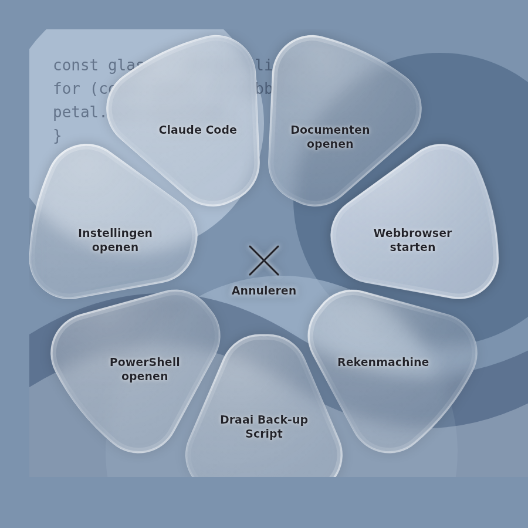

# CursorBubble

A Windows app that shows a **radial glass menu ("bubble") around your mouse
cursor** on a gesture. In the bubble you pick a shortcut that opens a program or
file, or runs a script. Layout, transparency and actions are all configured
inside the app.



> The image above is a **rendering** of the shapes and the glass effect as the
> app draws them (same geometry and gradients), not a Windows screenshot. The
> icons are stand-ins: in the app they come from the Windows system font
> **Segoe Fluent Icons**, which only exists on Windows.

## How it works

1. **Hold the right mouse button** and **then click left**.
2. The glass bubble appears around your cursor.
3. **Move** to a segment and **release the mouse button** to run that action.
4. Releasing in the centre ("Cancel") closes the bubble without doing anything.

An ordinary right click (without a left click alongside it) still works
normally: the context menu appears as soon as you release the right button.

### Without a mouse

Press **Ctrl+Alt+Space** and the bubble opens around your mouse pointer —
the same place the gesture puts it — ready for the keyboard. The combination
can be changed under **Settings → General**: click the field and press the keys
you want. Worth knowing: if another program already claims the combination,
CursorBubble says so in a tray notification and keeps the previous one, so pick
another.

A bubble opened this way answers to **both**: use the keys below, or just move
the mouse over a segment and click. Clicking the middle — or anywhere outside
the ring — cancels, exactly as releasing there does on the gesture.

| Key | What it does |
| --- | --- |
| `→` `↓` `Tab` | Next shortcut, clockwise |
| `←` `↑` `Shift+Tab` | Previous shortcut |
| `1`–`9` | Jump straight to that shortcut |
| `Home` / `End` | First / last shortcut |
| `Enter` or `Space` | Run the selected shortcut |
| `Esc` | Close without running anything |
| `Ctrl+Alt+Space` again | Also closes it |

The arrow keys walk the ring as a **list**, not as a compass: "next" is always
the following shortcut clockwise, in the same order they appear in the settings
list, whichever side of the ring it is on. This stays predictable when the ring
is rotated with **Start angle**, which a compass mapping would not.

The bubble **opens with nothing selected**, so pressing Enter straight away
cancels rather than running whatever happened to be first. A screen reader
announces how many shortcuts there are on opening, then each selection as
"Open Documents, 2 of 7". When the bubble closes, focus goes back to the window
you were in before, so the shortcut acts on the right thing.

The app runs in the background with an **icon in the system tray**. From the
tray menu you open **Settings**, toggle **Start with Windows**, or exit.

## Settings

Right-click (or double-click) the tray icon → **Settings…**. It opens on the
Overview page, with the rest of the app down the left-hand side:

- **Overview** — what the bubble has actually done for you: how often it has
  been opened and by which route, how many actions it has run, which segment is
  your favourite, how many days in a row you have used it, and a rough estimate
  of the time that saved. Underneath, a ranking of your busiest segments, a
  handful of facts drawn from the same numbers, and a list of every group of
  settings — click one to go there.
- **General** — autostart, the keyboard shortcut that opens the bubble, whether
  any of this is counted, and a short how-to. To change the shortcut, click the
  field and press the combination you want; `Tab` leaves the field without
  changing it.
- **Layout** — outer/inner radius, start angle, the gap between segments and how
  rounded their corners are.
- **Segments** — add, edit, remove and reorder segments. Per segment: name,
  action, target, arguments and an icon. Pick an icon from the list (from the
  Windows font Segoe Fluent Icons) or point at your own `.png`/`.ico`, which
  takes priority.
- **Style** — glass blur (acrylic) on/off, **animate on open**, glass opacity,
  and the glass, accent and text colours.
- **AI** — your Anthropic key and the Claude model that writes your scripts.
- **Claude Code** — link the inbox so sessions reach the bubble.
- **About** — version, where each of your files lives, and the button that
  deletes your statistics.

The settings window itself has the same glass look: a real acrylic backdrop on
**Windows 11**, a flat dark theme on **Windows 10**. The pages that change how
the bubble looks — Layout, Segments and Style — carry a **live preview**
underneath them; the ones that do not get the height back instead. The footer
says when there is something unsaved, and closing the window with the title bar
asks before throwing it away.

Settings are stored in `%APPDATA%\CursorBubble\config.json`.

### What gets counted

The Overview page is filled from `%APPDATA%\CursorBubble\usage.json`: opens
(split by gesture and shortcut), actions run per segment and per kind, cancels,
generated scripts, and the days you used it — about a year of them, for the
streak.

It is a plain file next to your settings. Nothing is sent anywhere: there is no
network code behind it. Untick **General → Count how often I use the bubble** to
stop counting, and **About → Delete my statistics** to throw away what is there.

### Action types

| Action | Target field | Example |
|--------|--------------|---------|
| Open (file/folder/URL) | path, folder or URL | `https://google.com`, `%USERPROFILE%\Documents` |
| Launch program | path to an `.exe` (+ arguments) | `calc.exe`, `notepad.exe` |
| Run script / command | `.bat`/`.cmd`/`.ps1`, or a command | `powershell -Command "..."` |

`%VAR%` environment variables in the target are expanded automatically.

### Writing a script with AI

Instead of writing a script yourself you can have one generated:

1. Enter your **Anthropic API key** under **Settings → AI** (create one at
   console.anthropic.com). Pick a cheaper model if you like.
2. Go to **Segments**, select a segment and click **✨ Generate script with AI…**.
3. Describe in plain language what the script should do (e.g. *"back up my
   documents to D:\Backups"*).
4. Claude writes a PowerShell script. **Read it through**, then click **Use
   this** — it is saved to `%APPDATA%\CursorBubble\scripts\` and attached to the
   segment.

The script is never run automatically; it only runs when you pick that segment
in the bubble. The API key is stored **encrypted** in `config.json` using the
Windows Data Protection API (DPAPI) — only your Windows account on this PC can
decrypt it. Each generation costs a small amount of API credit.

## Claude Code inbox

Working with several Claude Code sessions (in VS Code or separate terminals)?
You can answer them from the bubble.

1. **Settings → Claude Code → Link Claude Code.** This adds `Stop` and
   `Notification` hooks to your `~/.claude/settings.json`. Restart running
   sessions so the hooks take effect.
2. As soon as a session **stops** or **has a question**, you get a tray
   notification and a **badge** with the count on the "Claude Code" segment in
   the bubble.
3. Pick that segment → a glass window opens with the pending sessions. The
   question/status plus context at the top, a **text field** below it.
4. Type your reply → **Send** → CursorBubble puts it on the clipboard, brings
   the right window to the front, and pastes + sends it (Enter).

**How it works / limitations:**
- Detection runs through Claude Code hooks; the hook passes the last message
  (`last_assistant_message`) or the notification directly — the transcript is
  not parsed (that format is unstable).
- Sending replies back is **not officially supported** by Claude Code;
  CursorBubble simulates keystrokes in the owning window. That window is found
  through the session's parent process (falling back to the project folder name
  in the window title, and only on an **unambiguous** match against a
  terminal/editor window).
- It **never types blind**: Ctrl+V and Enter only go out once the target window
  is confirmed to be in the foreground. If that fails, the session stays pending
  and your reply is left on the clipboard for you to paste — so an Enter never
  lands in the wrong window.
- Your previous clipboard contents are restored after a successful send.
- A brief focus switch to the target window is visible.
- Structured multiple-choice questions arrive as text; you type your answer.

## Downloading a ready-made .exe

On every commit, GitHub Actions builds the app on a real Windows runner and
publishes a **self-contained `CursorBubble.exe`** (no .NET install needed):

GitHub → **Actions** tab → the topmost (green) **Build** run → **Artifacts** at
the bottom → download **CursorBubble** and unzip.

## Something went wrong

CursorBubble writes a log to `%APPDATA%\CursorBubble\logs\`, one file per day,
kept for a week. Startup, failed actions and any unexpected error land there. If
you report a problem, that file is the useful thing to attach.

An unexpected error while the app is running is logged and shown as a tray
notification rather than taking the app down.

## Building and running

> Requires **Windows 10/11** and the **.NET 8 SDK** (WPF only builds on Windows).

```powershell
# In the folder containing CursorBubble.sln
dotnet run --project src/CursorBubble

# Run the tests
dotnet test
```

To produce a standalone `.exe`:

```powershell
dotnet publish src/CursorBubble -c Release -r win-x64 --self-contained `
  -p:PublishSingleFile=true
```

The `.exe` then lives in
`src/CursorBubble/bin/Release/net8.0-windows/win-x64/publish/`.

## How it is built

- **C# / WPF (.NET 8)** — a native Windows overlay.
- A **global mouse hook** (`WH_MOUSE_LL`) recognises the gesture and suppresses
  the context menu; an ordinary right click is replayed with `SendInput`.
- A **transparent, top-most, click-through overlay window**; hit-testing runs
  off the global cursor position, so a held mouse button is not a problem.
- **Liquid glass** — each segment is a rounded shape with a thin, transparent
  body and a rim of light that runs along its edge like refraction (a wide soft
  band plus a narrow bright line), with a specular gloss on top.
- **Frosted glass** via `DwmEnableBlurBehindWindow`, with a region that follows
  **the segments themselves** rather than one big circle: the desktop is blurred
  only underneath the glass, while the gaps and the centre stay sharp.
- **DPI-aware** (Per-Monitor v2); the bubble is placed on the cursor in physical
  pixels.
- **A global hotkey** via `RegisterHotKey` rather than a keyboard hook. A
  low-level keyboard hook is a keylogger, and `SetForegroundWindow` is only
  allowed to hand focus to the overlay because the process is handling a hotkey
  event — a hook does not get that.
- **Accessible**: every field is associated with its label, the custom control
  templates draw a visible keyboard focus ring, status lines are announced as
  live regions, and the bubble exposes itself to screen readers through a focus
  proxy rather than through per-segment automation peers.

### Known limitations

- The blur behind the bubble uses `DwmEnableBlurBehindWindow`. On some Windows
  versions that blur is subtle or disabled; in that case turn **Glass blur
  (acrylic)** off — the segments are then tinted flatly instead of blurred. The
  bubble is always visible as glass either way.
- While the app runs, every right click is held very briefly and replayed on
  release (needed to detect the gesture).
- Right-dragging (dragging with the right button held) is not passed through.
- Only the first nine shortcuts have a number-key shortcut. A larger ring is
  still fully reachable with the arrow keys.
- If another application has already claimed the hotkey, registering it fails
  and the tray icon says so. Pick a different combination in settings; the
  previous one stays active until a new one works.

### Verified by hand, not by CI

The build runs on a Windows runner, so it compiles the app and runs the unit
tests, but nothing there can operate a window or a screen reader. These need a
person on Windows:

- the hotkey opens the bubble, and does so from a full-screen application;
- the bubble actually takes focus (it logs a warning to
  `%APPDATA%\CursorBubble\logs` if it does not) and the previous window is back
  in front by the time the shortcut runs;
- the acrylic blur still looks right after the window switches to keyboard mode;
- the focus ring is visible on the dark settings chrome and on the glass;
- Narrator actually reads the bubble and the four status lines aloud.

That last one used to include "and each field's label", because a label
association is a runtime binding and a typo in one compiles cleanly. It is now
checked in CI instead: the windows are constructed in a test, every `LabeledBy`
binding is resolved against the window, and each one has to point at the caption
it claims to. That proves the wiring is intact — not that a screen reader speaks
it, which is why the line above still exists.

### Cutting a release

Tagging a commit builds a versioned exe, attaches a SHA-256 checksum and opens a
draft GitHub release:

```powershell
git tag v1.0.0
git push origin v1.0.0
```

The executable is **not code-signed**, so Windows SmartScreen warns on first run
(*More info* → *Run anyway*). Signing needs a certificate, which is the one thing
that cannot be solved in the repository.

## Contributing

See [CONTRIBUTING.md](CONTRIBUTING.md). The short version: WPF only builds on
Windows, so GitHub Actions is the compiler if you are not on it, and warnings
are errors.

Found a security problem? [SECURITY.md](SECURITY.md) has the private reporting
route and a written-down account of what this app is able to do — worth reading
before installing it, since it hooks the mouse, launches processes and edits
Claude Code's configuration.

Changes are listed in [CHANGELOG.md](CHANGELOG.md).

## Licence

MIT — see [LICENSE](LICENSE).

## Project layout

```
src/CursorBubble/
  App.xaml(.cs)            startup, tray + hook
  Native/                  P/Invoke, mouse hook + gesture, blur helper
  Overlay/                 transparent window + radial glass drawing
  Settings/                the app window: overview, pages, live preview, AI dialog
  Ai/                      script generation via the Claude API + storage
  ClaudeCode/              hook handler, inbox storage, hook installer
  Responder/               glass window for answering sessions
  Config/                  model + JSON storage, and what can be configured
  Stats/                   usage counters + the facts drawn from them
  Input/                   global hotkey: parsing + registration
  Accessibility/           screen-reader announcements
  Controls/                small shared controls
  Actions/                 running actions
  Tray/                    system tray icon + autostart
  Diagnostics/             file log
tests/CursorBubble.Tests/  unit tests for the logic that has no UI in it
```
